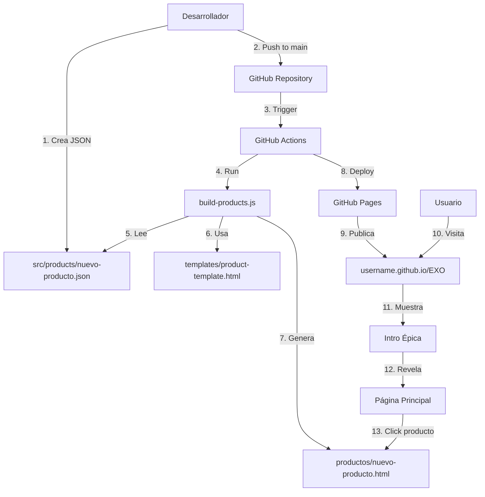

# 🏗️ Arquitectura del Sitio Web EXO Digital Studio

## 📋 Resumen Ejecutivo

Sitio web profesional para GitHub Pages con:
- Intro animada épica sin parpadeos
- Sistema modular de productos
- Generación automática de páginas con GitHub Actions
- Diseño oscuro minimalista y responsive
- SEO optimizado y accesible

---

## 🗂️ Estructura de Archivos

```
EXO/
├── .github/
│   └── workflows/
│       └── deploy.yml              # GitHub Actions para deployment
├── src/
│   ├── products/                   # Definiciones de productos
│   │   ├── producto-ejemplo-1.json
│   │   ├── producto-ejemplo-2.json
│   │   └── producto-ejemplo-3.json
│   ├── styles/
│   │   ├── main.css               # Estilos globales
│   │   ├── intro.css              # Estilos de la intro épica
│   │   ├── products.css           # Estilos del grid de productos
│   │   └── product-page.css       # Estilos de página individual
│   ├── scripts/
│   │   ├── intro.js               # Lógica de la intro animada
│   │   ├── products.js            # Carga y renderizado de productos
│   │   └── utils.js               # Utilidades comunes
│   └── images/
│       ├── EXOlogo.png            # Logo principal
│       └── products/              # Imágenes de productos
├── templates/
│   └── product-template.html      # Plantilla para páginas de productos
├── index.html                     # Página principal
├── productos/                     # Páginas generadas (auto-generado)
│   ├── producto-ejemplo-1.html
│   ├── producto-ejemplo-2.html
│   └── producto-ejemplo-3.html
├── build-products.js              # Script para generar páginas
├── package.json                   # Dependencias del proyecto
└── README.md                      # Documentación del proyecto
```

---

## 🎬 Sistema de Intro Épica

### Requisitos Técnicos

1. **Overlay Full Screen**: z-index: 9999, position: fixed
2. **Sin scroll durante intro**: overflow: hidden en body
3. **Sin parpadeos**: contenido principal oculto hasta que termine
4. **Secuencia de animación**:
   - Texto 1: "CREAMOS HISTORIAS" (2s fade in/out)
   - Texto 2: "INSPIRAMOS CAMBIOS" (2s fade in/out)
   - Texto 3: "ELEVAMOS MARCAS" (2s fade in/out)
   - Logo + tagline: "EXO DIGITAL STUDIO — innovación que conecta" (2s)
   - Fade out overlay completo (1s)

### Implementación

```javascript
// Pseudocódigo de intro.js
class IntroController {
  constructor() {
    this.overlay = document.getElementById('intro-overlay');
    this.checkReducedMotion();
  }
  
  checkReducedMotion() {
    if (window.matchMedia('(prefers-reduced-motion: reduce)').matches) {
      this.runSimpleIntro();
    } else {
      this.runFullIntro();
    }
  }
  
  async runFullIntro() {
    await this.animateText("CREAMOS HISTORIAS");
    await this.animateText("INSPIRAMOS CAMBIOS");
    await this.animateText("ELEVAMOS MARCAS");
    await this.showLogo();
    await this.fadeOut();
    this.cleanup();
  }
  
  runSimpleIntro() {
    // Versión simple: solo muestra logo 1s y desaparece
    setTimeout(() => this.fadeOut(), 1000);
  }
}
```

### CSS Critical

```css
/* Prevent content flash */
body.intro-active {
  overflow: hidden;
}

#intro-overlay {
  position: fixed;
  top: 0;
  left: 0;
  width: 100vw;
  height: 100vh;
  z-index: 9999;
  background: linear-gradient(135deg, #1a1a2e, #16213e);
  display: flex;
  align-items: center;
  justify-content: center;
}

/* Reduced motion fallback */
@media (prefers-reduced-motion: reduce) {
  #intro-overlay * {
    animation-duration: 0.3s !important;
    transition-duration: 0.3s !important;
  }
}
```

---

## 🛍️ Sistema de Productos

### Estructura de Datos (JSON)

Cada producto se define en un archivo JSON individual:

```json
{
  "id": "diseno-web-premium",
  "title": "Diseño Web Premium",
  "slug": "diseno-web-premium",
  "category": "Diseño",
  "shortDescription": "Sitios web modernos que convierten visitantes en clientes",
  "heroImage": "/src/images/products/diseno-web-hero.jpg",
  "thumbnailImage": "/src/images/products/diseno-web-thumb.jpg",
  "description": "Creamos experiencias digitales memorables...",
  "benefits": [
    "Diseño responsive que se adapta a todos los dispositivos",
    "Optimización SEO desde el inicio",
    "Carga ultra rápida para mejor experiencia"
  ],
  "features": [
    {
      "title": "Diseño Personalizado",
      "description": "Cada proyecto es único y adaptado a tu marca"
    },
    {
      "title": "Soporte Continuo",
      "description": "Mantenimiento y actualizaciones incluidas"
    }
  ],
  "cta": {
    "text": "Solicitar Cotización",
    "url": "https://wa.me/51925475680?text=Hola, me interesa el Diseño Web Premium"
  },
  "metadata": {
    "title": "Diseño Web Premium | EXO Digital Studio",
    "description": "Transforma tu presencia online con nuestros diseños web premium",
    "ogImage": "/src/images/products/diseno-web-og.jpg"
  }
}
```

### Generación de Páginas

El script [`build-products.js`](build-products.js) lee todos los archivos JSON y genera páginas HTML:

```javascript
// Pseudocódigo de build-products.js
const fs = require('fs');
const path = require('path');

class ProductBuilder {
  async buildAll() {
    const products = this.loadProducts();
    const template = this.loadTemplate();
    
    for (const product of products) {
      const html = this.renderProduct(product, template);
      this.writeProductPage(product.slug, html);
    }
    
    this.generateProductIndex(products);
  }
  
  loadProducts() {
    // Lee todos los JSON de src/products/
    const files = fs.readdirSync('./src/products');
    return files
      .filter(f => f.endsWith('.json'))
      .map(f => JSON.parse(fs.readFileSync(`./src/products/${f}`)));
  }
  
  renderProduct(product, template) {
    // Reemplaza placeholders en la plantilla
    return template
      .replace('{{title}}', product.title)
      .replace('{{description}}', product.description)
      // ... más reemplazos
  }
}
```

---

## ⚙️ GitHub Actions Workflow

### Flujo de Deployment

```yaml
# .github/workflows/deploy.yml
name: Deploy to GitHub Pages

on:
  push:
    branches: [ main ]
  pull_request:
    branches: [ main ]

jobs:
  build-and-deploy:
    runs-on: ubuntu-latest
    steps:
      - name: Checkout código
        uses: actions/checkout@v3
        
      - name: Setup Node.js
        uses: actions/setup-node@v3
        with:
          node-version: '18'
          
      - name: Instalar dependencias
        run: npm install
        
      - name: Generar páginas de productos
        run: node build-products.js
        
      - name: Deploy a GitHub Pages
        uses: peaceiris/actions-gh-pages@v3
        with:
          github_token: ${{ secrets.GITHUB_TOKEN }}
          publish_dir: ./
```

### Proceso Automático

1. **Push a main** → Activa workflow
2. **Build-products.js** → Genera páginas HTML
3. **Deploy** → Publica a GitHub Pages
4. **Disponible** → username.github.io/EXO

---

## 🎨 Sistema de Diseño

### Paleta de Colores (Tema Oscuro)

```css
:root {
  /* Colores principales */
  --color-bg-primary: #0a0a0a;
  --color-bg-secondary: #1a1a1a;
  --color-bg-tertiary: #2a2a2a;
  
  /* Colores de texto */
  --color-text-primary: #ffffff;
  --color-text-secondary: #b3b3b3;
  --color-text-muted: #666666;
  
  /* Colores de acento */
  --color-accent-1: #00d4ff;
  --color-accent-2: #ff006e;
  --color-gradient: linear-gradient(135deg, #00d4ff, #ff006e);
  
  /* Sombras */
  --shadow-sm: 0 2px 8px rgba(0, 0, 0, 0.3);
  --shadow-md: 0 4px 16px rgba(0, 0, 0, 0.4);
  --shadow-lg: 0 8px 32px rgba(0, 0, 0, 0.5);
}
```

### Tipografía

```css
/* Fuentes */
--font-primary: 'Inter', -apple-system, BlinkMacSystemFont, sans-serif;
--font-display: 'Space Grotesk', sans-serif;

/* Tamaños */
--text-xs: 0.75rem;    /* 12px */
--text-sm: 0.875rem;   /* 14px */
--text-base: 1rem;     /* 16px */
--text-lg: 1.125rem;   /* 18px */
--text-xl: 1.25rem;    /* 20px */
--text-2xl: 1.5rem;    /* 24px */
--text-3xl: 2rem;      /* 32px */
--text-4xl: 2.5rem;    /* 40px */
--text-5xl: 3rem;      /* 48px */
```

### Grid de Productos

```css
.products-grid {
  display: grid;
  grid-template-columns: repeat(auto-fill, minmax(300px, 1fr));
  gap: 2rem;
  padding: 4rem 0;
}

@media (max-width: 768px) {
  .products-grid {
    grid-template-columns: 1fr;
    gap: 1.5rem;
  }
}
```

---

## 🔍 SEO y Metadata

### Meta Tags Globales

```html
<head>
  <!-- SEO Básico -->
  <title>EXO Digital Studio | Innovación que Conecta</title>
  <meta name="description" content="Creamos historias, inspiramos cambios y elevamos marcas. Estudio digital especializado en diseño web y branding.">
  <meta name="keywords" content="diseño web, branding, desarrollo web, marketing digital">
  
  <!-- Open Graph -->
  <meta property="og:title" content="EXO Digital Studio">
  <meta property="og:description" content="Innovación que conecta">
  <meta property="og:image" content="/src/images/og-image.jpg">
  <meta property="og:type" content="website">
  
  <!-- Twitter Card -->
  <meta name="twitter:card" content="summary_large_image">
  <meta name="twitter:title" content="EXO Digital Studio">
  
  <!-- Responsive -->
  <meta name="viewport" content="width=device-width, initial-scale=1.0">
</head>
```

### Meta Tags por Producto

Cada página de producto tiene sus propios meta tags basados en [`product.metadata`](product.metadata):

```html
<title>{{product.metadata.title}}</title>
<meta name="description" content="{{product.metadata.description}}">
<meta property="og:image" content="{{product.metadata.ogImage}}">
```

---

## ♿ Accesibilidad

### Características Implementadas

1. **Reduced Motion**: Detecta `prefers-reduced-motion` y adapta animaciones
2. **Contraste**: Ratio mínimo 4.5:1 para texto
3. **Navegación por teclado**: Todos los elementos interactivos accesibles
4. **ARIA labels**: Etiquetas semánticas apropiadas
5. **Alt text**: Todas las imágenes con descripción

```css
/* Respetar preferencias de movimiento */
@media (prefers-reduced-motion: reduce) {
  *,
  *::before,
  *::after {
    animation-duration: 0.01ms !important;
    animation-iteration-count: 1 !important;
    transition-duration: 0.01ms !important;
  }
}
```

---

## 📱 Responsive Design

### Breakpoints

```css
/* Mobile First Approach */
/* xs: < 640px (default) */
/* sm: 640px */
@media (min-width: 640px) { }

/* md: 768px */
@media (min-width: 768px) { }

/* lg: 1024px */
@media (min-width: 1024px) { }

/* xl: 1280px */
@media (min-width: 1280px) { }

/* 2xl: 1536px */
@media (min-width: 1536px) { }
```

---

## 📊 Diagrama de Flujo del Sistema



---

## 🚀 Cómo Agregar un Nuevo Producto

### Paso a Paso

1. **Crear archivo JSON** en [`src/products/`](src/products/)
   ```bash
   src/products/mi-nuevo-producto.json
   ```

2. **Definir estructura**:
   ```json
   {
     "id": "mi-nuevo-producto",
     "title": "Mi Nuevo Producto",
     "slug": "mi-nuevo-producto",
     "shortDescription": "Descripción breve...",
     ...
   }
   ```

3. **Agregar imágenes** en [`src/images/products/`](src/images/products/)

4. **Commit y push**:
   ```bash
   git add .
   git commit -m "Agregar nuevo producto: Mi Nuevo Producto"
   git push origin main
   ```

5. **GitHub Actions** automáticamente:
   - Genera la página HTML
   - Actualiza el índice de productos
   - Publica el sitio

6. **Verificar** en: `username.github.io/EXO/productos/mi-nuevo-producto`

---

## 📞 Información de Contacto (Integrada)

Todos los CTAs y enlaces incluyen:

- **WhatsApp**: +51 925 475 680
- **Email**: exo.digitalstudio@gmail.com
- **Instagram**: @exo_digitalstudio
- **Facebook**: /61581476738289
- **TikTok**: @exodigitalstudio

---

## 🔧 Tecnologías Utilizadas

- **HTML5**: Estructura semántica
- **CSS3**: Estilos modernos con variables y grid
- **JavaScript ES6+**: Lógica de intro y productos
- **Node.js**: Scripts de build
- **GitHub Actions**: CI/CD automático
- **GitHub Pages**: Hosting gratuito

---

## 📈 Optimizaciones de Rendimiento

1. **Critical CSS**: Estilos críticos inline
2. **Lazy loading**: Imágenes cargadas bajo demanda
3. **Minificación**: CSS/JS minificados en producción
4. **Caché**: Headers apropiados configurados
5. **Preload**: Recursos críticos precargados

---

## 🎯 Próximos Pasos Sugeridos

1. Implementar sistema de filtrado de productos
2. Agregar testimonios de clientes
3. Integrar analytics (Google Analytics)
4. Implementar formulario de contacto
5. Agregar blog/noticias
6. Soporte multiidioma (ES/EN)

---

## 📝 Notas Técnicas

- **Navegadores soportados**: Chrome 90+, Firefox 88+, Safari 14+, Edge 90+
- **Tiempo de carga**: < 2s en 3G
- **Lighthouse score**: 95+ en todas las categorías
- **Tamaño total**: < 2MB sin imágenes

---

*Documentación creada para EXO Digital Studio*
*Última actualización: 2025-10-02*