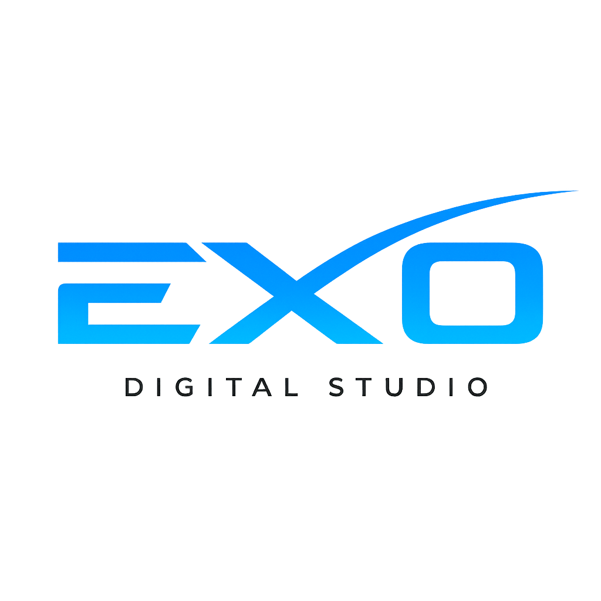

# 🎬 Especificaciones de la Nueva Intro - EXO Digital Studio

## 📋 Resumen de Cambios

La intro ahora tendrá una secuencia mejorada con barra de carga y logo, manteniendo el estilo oscuro minimalista.

## 🎯 Nueva Secuencia de Animación

### Fase 1: Pantalla de Carga (2-3 segundos)
- **Fondo**: Negro puro (#000000)
- **Logo**: EXOlogo.png centrado (150px de altura)
- **Barra de carga**: Debajo del logo
  - Color: Gradiente cyan (#00d4ff) a magenta (#ff006e)
  - Ancho: 200px, altura: 4px
  - Animación: Llenado de 0% a 100%
  - Duración: 2 segundos
- **Efecto**: Fade in al inicio, fade out al final

### Fase 2: Frases Animadas (6-9 segundos)
- **Fondo**: Negro puro (#000000)
- **Secuencia automática** (no controlable):
  1. "CREAMOS HISTORIAS" (2 segundos)
  2. "INSPIRAMOS CAMBIOS" (2 segundos)  
  3. "ELEVAMOS MARCAS" (2 segundos)
- **Animación entre frases**:
  - Fade out de frase actual (0.3s)
  - Fade in de siguiente frase (0.3s)
  - Efecto de deslizamiento sutil
- **Tipografía**: Space Grotesk, 700 weight
- **Color**: Gradiente cyan a magenta
- **Tamaño**: clamp(2rem, 8vw, 4rem)
- **Posición**: Centrado vertical y horizontal

### Fase 3: Fade Out Final (1 segundo)
- Transición suave a la página principal
- Sin parpadeos del contenido

## 🎨 Especificaciones de Estilo

### Colores
```css
--intro-bg: #000000;  /* Negro puro */
--intro-accent-1: #00d4ff;  /* Cyan */
--intro-accent-2: #ff006e;  /* Magenta */
--intro-gradient: linear-gradient(135deg, #00d4ff, #ff006e);
```

### Tipografía
```css
--intro-font: 'Space Grotesk', sans-serif;
--intro-font-size: clamp(2rem, 8vw, 4rem);
--intro-font-weight: 700;
--intro-letter-spacing: -0.02em;
```

### Logo
```css
--intro-logo-size: 150px;
--intro-logo-filter: drop-shadow(0 4px 20px rgba(0, 212, 255, 0.3));
```

### Barra de Carga
```css
--loading-bar-width: 200px;
--loading-bar-height: 4px;
--loading-bar-radius: 2px;
```

## 📱 Responsive Design

### Mobile (< 768px)
- Logo: 100px de altura
- Texto: clamp(1.5rem, 10vw, 2.5rem)
- Barra de carga: 150px de ancho

### Tablet (768px - 1024px)
- Logo: 125px de altura
- Texto: clamp(1.8rem, 6vw, 3.5rem)
- Barra de carga: 175px de ancho

### Desktop (> 1024px)
- Logo: 150px de altura
- Texto: clamp(2rem, 8vw, 4rem)
- Barra de carga: 200px de ancho

## ♿ Accesibilidad

### Reduced Motion
- Versión simplificada:
  - Logo visible por 1 segundo
  - Frases aparecen sin animaciones complejas
  - Duración total: 3 segundos

### Atributos ARIA
- `role="presentation"` en el overlay
- `aria-live="polite"` para anuncios de estado
- `aria-label` en elementos interactivos

## ⚡ Performance

### Optimizaciones
- CSS animations en lugar de JavaScript
- Transformaciones GPU-acceleradas
- Preload del logo
- Mínimo reflow/repaint

### Duraciones
- **Total intro**: 6-9 segundos (normal), 3 segundos (reduced motion)
- **Fase carga**: 2 segundos
- **Cada frase**: 2 segundos
- **Transiciones**: 0.3 segundos

## 🔧 Implementación Técnica

### Estructura HTML
```html
<div id="intro-overlay" role="presentation" aria-live="polite">
  <!-- Fase 1: Loading -->
  <div class="intro-loading-container">
    
    <div class="intro-loading-bar">
      <div class="intro-loading-progress"></div>
    </div>
  </div>
  
  <!-- Fase 2: Frases -->
  <div class="intro-texts-container">
    <div class="intro-text active">CREAMOS HISTORIAS</div>
    <div class="intro-text">INSPIRAMOS CAMBIOS</div>
    <div class="intro-text">ELEVAMOS MARCAS</div>
  </div>
</div>
```

### Lógica JavaScript
```javascript
class IntroController {
  constructor() {
    this.phases = ['loading', 'texts'];
    this.currentPhase = 0;
    this.texts = ['CREAMOS HISTORIAS', 'INSPIRAMOS CAMBIOS', 'ELEVAMOS MARCAS'];
    this.currentTextIndex = 0;
    this.isReducedMotion = false;
  }
  
  async start() {
    await this.runLoadingPhase();
    await this.runTextsPhase();
    await this.fadeOut();
    this.cleanup();
  }
  
  async runLoadingPhase() {
    // Mostrar logo y barra de carga
    // Animar barra de 0% a 100%
    // Fade out de fase de carga
  }
  
  async runTextsPhase() {
    // Mostrar cada frase con animación
    // Transición suave entre frases
  }
}
```

### CSS Keyframes
```css
@keyframes loadingProgress {
  from { width: 0%; }
  to { width: 100%; }
}

@keyframes textFadeInOut {
  0% { opacity: 0; transform: translateY(20px); }
  20% { opacity: 1; transform: translateY(0); }
  80% { opacity: 1; transform: translateY(0); }
  100% { opacity: 0; transform: translateY(-20px); }
}

@keyframes fadeIn {
  from { opacity: 0; }
  to { opacity: 1; }
}

@keyframes fadeOut {
  from { opacity: 1; }
  to { opacity: 0; }
}
```

## 🎯 Favicon para Aplicaciones

### Archivos necesarios
- `favicon.ico` (32x32px)
- `apple-touch-icon.png` (180x180px)
- `icon-192.png` (192x192px)
- `icon-512.png` (512x512px)

### Implementación HTML
```html
<link rel="icon" type="image/x-icon" href="./favicon.ico">
<link rel="apple-touch-icon" sizes="180x180" href="./apple-touch-icon.png">
<link rel="icon" type="image/png" sizes="192x192" href="./icon-192.png">
<link rel="icon" type="image/png" sizes="512x512" href="./icon-512.png">
```

## 📝 Checklist de Implementación

### CSS
- [ ] Actualizar `src/styles/intro.css` con nueva estructura
- [ ] Agregar keyframes para barra de carga
- [ ] Implementar responsive breakpoints
- [ ] Agregar estilos reduced motion

### JavaScript
- [ ] Modificar `src/scripts/intro.js` con nueva lógica
- [ ] Implementar secuencia de fases
- [ ] Agregar control de duraciones
- [ ] Mantener compatibilidad reduced motion

### HTML
- [ ] Actualizar estructura en `index.html`
- [ ] Agregar favicon links
- [ ] Mantener atributos de accesibilidad

### Testing
- [ ] Probar en mobile, tablet, desktop
- [ ] Verificar reduced motion
- [ ] Comprobar accesibilidad
- [ ] Validar performance

## 🔄 Flujo de Trabajo

1. **Cambiar a modo Code** para implementar cambios
2. **Actualizar CSS** con nueva estructura de intro
3. **Modificar JavaScript** con nueva lógica
4. **Actualizar HTML** con favicon
5. **Probar localmente** la nueva secuencia
6. **Generar páginas** con `npm run build`
7. **Actualizar documentación** con cambios

## 📊 Métricas Objetivo

- **Tiempo total intro**: 6-9 segundos
- **Performance**: < 100ms para primera animación
- **Accesibilidad**: WCAG 2.1 AA compliant
- **Mobile score**: 95+ en Lighthouse

---

*Especificaciones creadas para la nueva intro de EXO Digital Studio*  
*Fecha: Octubre 2025*