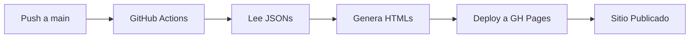

# 🚀 EXO Digital Studio - Sitio Web con GitHub Pages

> **Innovación que Conecta** - Sitio web profesional con intro épica y sistema modular de productos

[]()
[]()
[]()

---

## 📖 Descripción del Proyecto

Este proyecto es un sitio web profesional para **EXO Digital Studio** que incluye:

- ✨ **Intro épica animada** con transiciones tipográficas suaves
- 📦 **Sistema modular de productos** fácilmente gestionable
- 🤖 **Generación automática de páginas** con GitHub Actions
- 🎨 **Diseño oscuro minimalista** y totalmente responsive
- ♿ **Accesibilidad completa** con soporte para `prefers-reduced-motion`
- 🔍 **SEO optimizado** con meta tags y Open Graph

---

## 📚 Documentación

| Documento | Descripción |
|-----------|-------------|
| [`ARCHITECTURE.md`](ARCHITECTURE.md) | Arquitectura técnica completa del sistema |
| [`GUIA-PRODUCTOS.md`](GUIA-PRODUCTOS.md) | Guía para crear y gestionar productos |
| Este README | Resumen ejecutivo y guía de inicio rápido |

---

## 🎯 Características Principales

### 1. Intro Épica (Sin Parpadeos)

```
Pantalla completa → "CREAMOS HISTORIAS"
                  ↓
                  "INSPIRAMOS CAMBIOS"
                  ↓
                  "ELEVAMOS MARCAS"
                  ↓
                  Logo + "EXO DIGITAL STUDIO — innovación que conecta"
                  ↓
                  Fade out → Revela sitio
```

**Características técnicas**:
- Overlay con `z-index: 9999`
- Sin scroll durante la animación
- Respeta `prefers-reduced-motion`
- Duración total: ~9 segundos

### 2. Sistema de Productos

Cada producto es un archivo JSON independiente:

```json
{
  "id": "diseno-web-premium",
  "title": "Diseño Web Premium",
  "shortDescription": "Sitios web modernos...",
  "benefits": [...],
  "features": [...],
  "cta": {
    "text": "Solicitar Cotización",
    "url": "https://wa.me/51925475680?text=..."
  }
}
```

**Ventajas**:
- ✅ Agregar productos sin tocar código
- ✅ Generación automática de páginas
- ✅ URLs amigables: `/productos/nombre-producto`
- ✅ SEO individual por producto

### 3. GitHub Actions (CI/CD)



**Flujo automático**:
1. Creas/editas un JSON de producto
2. Haces commit y push
3. GitHub Actions genera las páginas
4. Tu sitio se actualiza automáticamente

---

## 🗂️ Estructura del Proyecto

```
EXO/
├── .github/workflows/
│   └── deploy.yml              # CI/CD automático
├── src/
│   ├── products/               # 📦 Productos (JSON)
│   │   ├── diseno-web-premium.json
│   │   ├── identidad-marca.json
│   │   └── gestion-redes.json
│   ├── styles/                 # 🎨 Estilos CSS
│   │   ├── main.css
│   │   ├── intro.css
│   │   └── products.css
│   ├── scripts/                # 💻 JavaScript
│   │   ├── intro.js
│   │   └── products.js
│   └── images/                 # 🖼️ Assets
│       ├── EXOlogo.png
│       └── products/
├── templates/
│   └── product-template.html   # Plantilla de producto
├── productos/                  # Páginas generadas (auto)
├── index.html                  # Página principal
├── build-products.js           # Generador de páginas
└── package.json
```

---

## 🚀 Inicio Rápido

### Agregar un Nuevo Producto

**Paso 1**: Crear archivo JSON en `src/products/`

```bash
src/products/mi-producto.json
```

**Paso 2**: Definir estructura

```json
{
  "id": "mi-producto",
  "title": "Mi Producto",
  "slug": "mi-producto",
  "shortDescription": "Descripción breve...",
  "heroImage": "/src/images/products/mi-producto/hero.jpg",
  "benefits": [
    "Beneficio 1",
    "Beneficio 2"
  ],
  "cta": {
    "text": "Solicitar Info",
    "url": "https://wa.me/51925475680?text=Hola"
  }
}
```

**Paso 3**: Agregar imágenes

```bash
src/images/products/mi-producto/
├── hero.jpg (1920x1080px)
└── thumb.jpg (600x400px)
```

**Paso 4**: Commit y push

```bash
git add .
git commit -m "Agregar producto: Mi Producto"
git push origin main
```

✅ **Listo!** GitHub Actions generará automáticamente la página.

---

## 🎨 Paleta de Colores

```css
/* Tema Oscuro Minimalista */
--color-bg-primary: #0a0a0a;      /* Negro profundo */
--color-bg-secondary: #1a1a1a;    /* Gris oscuro */
--color-text-primary: #ffffff;     /* Blanco */
--color-accent-1: #00d4ff;         /* Cyan */
--color-accent-2: #ff006e;         /* Magenta */
--gradient: linear-gradient(135deg, #00d4ff, #ff006e);
```

---

## 📱 Información de Contacto

Todos los CTAs del sitio conectan con:

- 📱 **WhatsApp**: [+51 925 475 680](https://wa.me/51925475680)
- 📧 **Email**: exo.digitalstudio@gmail.com
- 📸 **Instagram**: [@exo_digitalstudio](https://www.instagram.com/exo_digitalstudio/)
- 📘 **Facebook**: [EXO Digital Studio](https://www.facebook.com/profile.php?id=61581476738289)
- 🎵 **TikTok**: [@exodigitalstudio](https://www.tiktok.com/@exodigitalstudio)

---

## 🛠️ Stack Tecnológico

| Tecnología | Uso |
|------------|-----|
| **HTML5** | Estructura semántica |
| **CSS3** | Estilos modernos (Grid, Flexbox, Variables) |
| **JavaScript ES6+** | Lógica de intro y productos |
| **Node.js** | Script de generación de páginas |
| **GitHub Actions** | CI/CD automático |
| **GitHub Pages** | Hosting gratuito |

---

## 📦 Productos Sugeridos (Iniciales)

Te sugerimos comenzar con estos 3 productos:

### 1. 🎨 Diseño Web Premium
Sitios web modernos y responsive que convierten visitantes en clientes.

**Precio**: Desde $800 USD  
**Tiempo**: 2-4 semanas

### 2. 🎯 Identidad de Marca Completa
Construye una marca memorable que conecte con tu audiencia.

**Precio**: Desde $500 USD  
**Tiempo**: 1-2 semanas

### 3. 📱 Gestión de Redes Sociales
Impulsa tu presencia online con contenido estratégico y atractivo.

**Precio**: $300 USD/mes  
**Tiempo**: Inicio inmediato

> **Nota**: Consulta [`GUIA-PRODUCTOS.md`](GUIA-PRODUCTOS.md) para ver las especificaciones completas y plantillas JSON.

---

## ✅ Checklist de Implementación

### Fase 1: Configuración Base
- [ ] Crear estructura de archivos y directorios
- [ ] Configurar GitHub Actions workflow
- [ ] Preparar assets (logo, imágenes)

### Fase 2: Intro Épica
- [ ] Implementar overlay full-screen
- [ ] Crear animaciones tipográficas
- [ ] Agregar logo con efecto degradado
- [ ] Implementar `prefers-reduced-motion`

### Fase 3: Página Principal
- [ ] Diseñar hero section
- [ ] Crear grid de productos
- [ ] Agregar footer con contacto
- [ ] Implementar responsive design

### Fase 4: Sistema de Productos
- [ ] Crear plantilla HTML de producto
- [ ] Implementar script generador [`build-products.js`](build-products.js)
- [ ] Crear 3 productos de ejemplo
- [ ] Configurar rutas y enlaces

### Fase 5: Optimización
- [ ] Configurar SEO y meta tags
- [ ] Optimizar imágenes (WebP)
- [ ] Minificar CSS/JS
- [ ] Probar accesibilidad

### Fase 6: Deployment
- [ ] Probar localmente
- [ ] Configurar GitHub Pages
- [ ] Verificar deployment automático
- [ ] Testing cross-browser

---

## 🎯 Roadmap Futuro

### Versión 1.0 (Actual)
- ✅ Intro épica animada
- ✅ Sistema de productos modular
- ✅ GitHub Actions CI/CD
- ✅ Diseño responsive

### Versión 1.1 (Próxima)
- [ ] Sistema de filtrado de productos
- [ ] Testimonios de clientes
- [ ] Galería de portfolio
- [ ] Formulario de contacto

### Versión 2.0 (Futuro)
- [ ] Blog/Noticias
- [ ] Multi-idioma (ES/EN)
- [ ] Dashboard de analytics
- [ ] Sistema de cotizaciones online

---

## 📊 Métricas Objetivo

| Métrica | Objetivo |
|---------|----------|
| **Lighthouse Performance** | 95+ |
| **Lighthouse Accessibility** | 100 |
| **Lighthouse SEO** | 95+ |
| **Tiempo de carga** | < 2s (3G) |
| **Mobile Score** | 95+ |

---

## 🤝 Próximos Pasos

### Para Iniciar el Desarrollo

1. **Revisar este plan** y confirmar que cumple tus expectativas
2. **Cambiar al modo Code** para implementar la solución
3. **Seguir el checklist** paso a paso
4. **Probar localmente** antes de hacer deploy

### Comando para Cambiar a Modo Code

Una vez aprobado el plan, puedes usar el comando:
```
Cambiar a modo code para implementar
```

---

## 📝 Notas Importantes

1. **GitHub Pages Gratuito**: Usaremos rutas `/productos/nombre` en lugar de subdominios
2. **Sin Node Modules en Git**: El workflow de GitHub Actions instalará dependencias
3. **Imágenes Optimizadas**: Usa WebP cuando sea posible (< 200KB por imagen)
4. **Accesibilidad Primero**: Todas las animaciones respetan `prefers-reduced-motion`

---

## 📖 Documentación Adicional

- [Guía Completa de Arquitectura](ARCHITECTURE.md) - Detalles técnicos del sistema
- [Guía de Productos](GUIA-PRODUCTOS.md) - Cómo crear y gestionar productos
- [GitHub Pages Docs](https://docs.github.com/pages) - Documentación oficial
- [GitHub Actions Docs](https://docs.github.com/actions) - Referencia de workflows

---

## 💬 ¿Preguntas?

Si tienes alguna duda o sugerencia sobre este plan, puedes:

1. Revisar los documentos de arquitectura y guías
2. Solicitar ajustes o cambios al plan
3. Proceder con la implementación en modo Code

---

## 🎉 ¡Listo para Comenzar!

Este es un plan completo y detallado. Una vez que lo revises y estés satisfecho:

**Opción 1**: Hacer ajustes al plan (si es necesario)
**Opción 2**: Cambiar a modo Code para implementar

```bash
# El sitio estará disponible en:
https://tu-usuario.github.io/EXO
```

---

<div align="center">

**EXO Digital Studio**

*Creamos Historias • Inspiramos Cambios • Elevamos Marcas*

📱 +51 925 475 680 | 📧 exo.digitalstudio@gmail.com

</div>